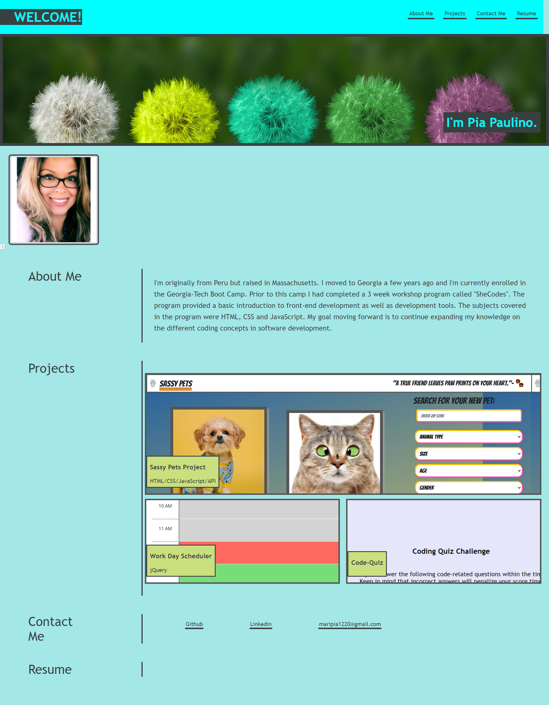

# portfolio-demo

## Project:

To create a portfolio with the core skills recently learned in class. Including grids, css variables and media queries. 

-----
## Details:

 
* Links are placed on the far right.  
* Brief summary about myself with picture.
* When links are clicked it navigates to the corresponding sections.
* A screen shot of my first assigned project and two other homework assignments along with their corresponding repositories.
* My Github and linkedin are also provided.

  

 ;

# Images:

Image by <a href="https://pixabay.com/users/monsterkoi-65294/?utm_source=link-attribution&amp;utm_medium=referral&amp;utm_campaign=image&amp;utm_content=2817950">Monsterkoi</a> from <a href="https://pixabay.com/?utm_source=link-attribution&amp;utm_medium=referral&amp;utm_campaign=image&amp;utm_content=2817950">Pixabay</a>

